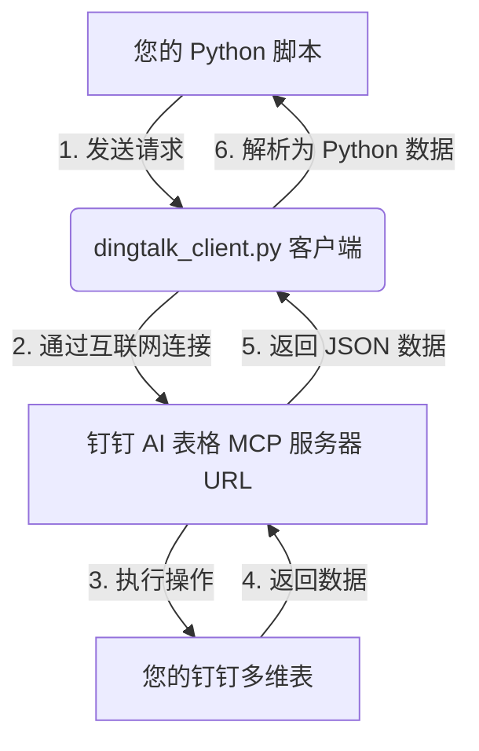

# 钉钉 AI 表格（多维表）Python 接口小白使用指南

本指南专为编程初学者或非技术背景用户设计。我们将从最基础的 Python 安装开始，一步步带您运行这个程序，并在您自己的其他 Python 脚本中调用钉钉 AI 表格。

> [!NOTE]
> **已解决 405 Method Not Allowed 错误：**
> 钉钉官方 MCP 服务网关使用的是较新的 **Streamable HTTP** 传输协议，不允许使用传统的 SSE (GET) 握手方法进行连接（会报错 405）。我们已经将客户端代码更新为支持 Streamable HTTP 协议（基于 POST 请求），确保能顺利连通您的钉钉服务器。

---

## 🌟 整体工作流程一览

在开始之前，我们需要明白这个程序是如何工作的：


---

## 🛠️ 第一步：准备工作（安装 Python）

要运行 Python 程序，您的电脑上必须安装有 Python 运行环境。

### 1. 检查电脑是否已安装 Python
打开终端（Windows 推荐使用 **PowerShell**，Mac/Linux 使用 **Terminal** 终端），输入以下命令并回车：
```bash
python --version
```
* **如果显示：** `Python 3.x.x`（例如 `Python 3.10.5`），说明已经安装，可以跳过安装步骤。
* **如果显示：** “未找到命令” 或 “command not found”，则需要安装。

### 2. 下载与安装 Python (Windows 用户)
1. 访问 [Python 官方下载页面](https://www.python.org/downloads/)。
2. 点击黄色的 **Download Python 3.x.x** 按钮下载安装包。
3. 双击运行下载好的 `.exe` 安装程序。
4. **【非常重要】** 在安装界面底部，勾选 **"Add python.exe to PATH"**（将 Python 添加到环境变量）。如果不勾选此项，后续命令行会找不到 Python。
5. 点击 **"Install Now"** 开始安装，安装完成后点击 Close 关闭。
6. 重新打开一个 PowerShell 窗口，再次运行 `python --version` 验证是否成功。

---

## 📁 第二步：定位项目文件

我们的项目代码已经为您存放在以下文件夹中：
`d:\SOFT\AI\github\ddt`

文件夹内包含三个关键文件：
1. `requirements.txt`：记录了程序运行所需的第三方 Python 扩展包（主要是 `mcp` 客户端 SDK）。
2. `dingtalk_client.py`：核心“连接器”代码，负责和钉钉的服务器进行复杂的协议通信，并把返回结果转换成简单的 Python 格式。**平时不需要修改它**。
3. `demo.py`：测试和运行实例，您可以在这里修改运行参数，或者参考它编写自己的新代码。

---

## 📦 第三步：安装依赖包（配置环境）

为了防止依赖库与您电脑上的其他项目冲突，推荐使用**虚拟环境**。

### 1. 打开命令行并进入项目文件夹
在 Windows 中，按下 `Win + R` 键，输入 `powershell` 回车。
输入以下命令进入项目目录（注意不要使用 cd 切换到其他盘符，直接复制以下命令）：
```powershell
d:
cd \SOFT\AI\github\ddt
```

### 2. 创建并激活虚拟环境（可选但推荐）
在终端中依次输入以下命令：
```powershell
# 1. 创建名为 venv 的虚拟环境
python -m venv venv

# 2. 激活虚拟环境 (Windows PowerShell)
.\venv\Scripts\Activate.ps1
```
*如果激活时遇到权限报错（如“禁止运行脚本”），可在 PowerShell 中运行 `Set-ExecutionPolicy -ExecutionPolicy RemoteSigned -Scope Process`，然后再运行上面的激活命令。*
* **激活成功标志：** 您的命令行开头会多出一个 `(venv)` 标记。

### 3. 安装依赖包
在激活的虚拟环境中，输入以下命令安装所需的库：
```bash
pip install -r requirements.txt
```
等待安装进度条走完，提示 `Successfully installed...` 即可。

---

## 🔑 第四步：获取钉钉 MCP 服务 URL

程序需要一个“服务器地址（URL）”才能找到您的钉钉表格服务。

1. 浏览器打开钉钉官方 MCP 详情页：[钉钉 MCP 详情](https://mcp.dingtalk.com/#/detail?mcpId=9555&detailType=marketMcpDetail)。
2. 登录您的钉钉账号。
3. 点击页面右侧的 **「获取 MCP Server 配置」** 或类似按钮。
4. 复制弹出的 **SSE 地址 / URL**。这个地址通常长这样：
   `https://openclaw.dingtalk.com/mcp/sse/xxxxxxx...`

---

## 🚀 第五步：设置环境变量并运行

我们将刚刚复制 the URL 告诉电脑，然后启动程序。

### 1. 设置环境变量
在刚刚打开的项目命令行窗口中，根据您的系统输入以下命令（将 `你的钉钉URL` 替换为刚才复制的长地址）：

* **Windows PowerShell（推荐）：**
  ```powershell
  $env:DINGTALK_MCP_URL="你的钉钉URL"
  ```
* **Windows 传统 CMD 命令提示符：**
  ```cmd
  set DINGTALK_MCP_URL=你的钉钉URL
  ```
* **Mac / Linux / Git Bash 终端：**
  ```bash
  export DINGTALK_MCP_URL="你的钉钉URL"
  ```

### 2. 运行演示程序
输入以下命令运行 `demo.py`：
```bash
python demo.py
```

### 3. 运行成功的表现
程序会输出类似下面的日志信息：
```text
2026-07-01 15:00:00 [INFO] dingtalk_ai_table_client: Connecting to DingTalk AI Table MCP Server...
2026-07-01 15:00:01 [INFO] dingtalk_ai_table_client: MCP Session initialized successfully.
2026-07-01 15:00:01 [INFO] demo: Fetching list of bases...
2026-07-01 15:00:02 [INFO] demo: Found base: '我的销售表格' with ID: base_xxxxxx
...
```
这说明您的 Python 程序已经成功跨越网络，连通了钉钉多维表服务！

---

## 💡 第六步：如何在自己的其他 Python 程序中使用

现在，您想用这个功能来写一个新的自动化脚本。您只需要按照下面的模板编写：

### 新建脚本模板 (`my_script.py`)
在同一个文件夹下，新建一个文本文件，重命名为 `my_script.py`，写入以下代码：

```python
import asyncio
import os
# 1. 导入我们封装好的客户端
from dingtalk_client import DingTalkAITableClient

async def main():
    # 2. 从环境变量中读取地址
    url = os.environ.get("DINGTALK_MCP_URL")
    
    # 3. 使用 async with 语法连接服务器
    async with DingTalkAITableClient(url) as client:
        
        # --- 示例：向指定的表格写入一条新数据 ---
        # 请先通过 demo.py 运行结果拿到真实的 baseId 和 tableId
        my_base_id = "base_xxxxxx"   
        my_table_id = "tbl_xxxxxx"
        
        # 准备要插入的数据行。Cells 里的键名是表格的“列字段 ID”（例如 fld_name）
        new_row = {
            "cells": {
                "fld_name": "张三",
                "fld_age": 18,
                "fld_city": "北京"
            }
        }
        
        print("正在向表格写入数据...")
        # 4. 调用创建记录方法
        result = await client.create_records(
            base_id=my_base_id,
            table_id=my_table_id,
            records=[new_row] # 支持批量写入，所以这里放入一个列表
        )
        print("写入结果：", result)

# 启动运行
if __name__ == "__main__":
    asyncio.run(main())
```

---

## ❓ 常见问题排查（Troubleshooting）

#### 1. 报错 `ModuleNotFoundError: No module named 'mcp'`
* **原因：** 没有安装依赖包，或者在运行程序时没有激活虚拟环境。
* **解决办法：** 确保命令行开头有 `(venv)`，如果没有，请重新运行 `.\venv\Scripts\Activate.ps1`，并确保运行过 `pip install -r requirements.txt`。

#### 2. 运行后一直卡住，或者提示连接超时 `TimeoutError`
* **原因：** 网络无法连接到钉钉服务器，或者您复制的 `DINGTALK_MCP_URL` 不正确。
* **解决办法：** 检查网络连接，并重新确认 URL 包含 `https://` 开头且没有多余的空格或换行。

#### 3. 运行提示 `RuntimeError: Client is not connected.`
* **原因：** 没有使用 `async with DingTalkAITableClient(...) as client:` 语法。
* **解决办法：** 所有对 `client` 的调用必须包含在 `async with` 代码块内部。
